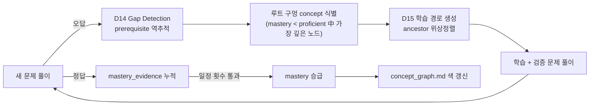

# 📐 Math Study — LWIP Knowledge Mesh

> **LLM-Wiki Implementation Protocol (v1.2) · 수학 도메인 커스터마이즈**
> 흩어진 수학 학습 자료를 압축되고 추적 가능한 지식 신경망으로 만든다.

이 wiki가 추적하는 것:

1. **수학 개념**과 그 선수관계(prerequisite DAG)
2. **대한민국 수능·평가원·교육청 모의고사 기출** 문제와 풀이/분류
3. **학습 도구·자료**(책·강의·문제집·사이트)
4. **오답노트**(틀린 이유와 학습 구멍의 위치)

---

## 💡 왜 이 시스템인가

기존의 노트·문제풀이 앱은 데이터를 *모으기*는 잘 해도 *연결*을 못 한다. 수학은 본질적으로 **선수 개념의 사슬**이라, 어디서 막혔는지 정확히 짚지 못하면 같은 자리에서 반복해서 헤매게 된다.

LWIP는 모든 지식 노드를 양방향 의존 그래프로 묶고, 오답이 발생하면 그래프를 역추적해 **"학습을 막고 있는 가장 깊은 구멍"** 을 자동으로 찾아낸다. 학습 자료는 단순한 더미가 아니라, *언제든 진단·복습·재구성이 가능한 신경망*이 된다.

---

## 🏛️ Heritage & Evolution

LWIP는 Andrej Karpathy의 "LLM-Wiki" 비전을 출발점으로, Zero-Entropy 메트릭과 자동화된 거버넌스를 결합한 엔지니어링 프로토콜이다. 본 프로젝트는 LWIP v1.2 표준에 **Chapter 7 — Domain Rules (Math Study) D1~D16**을 더해 수학 학습 도메인에 특화시킨 구현이다.

표준 LWIP 문맥은 [`LWIP_Specification.md`](LWIP_Specification.md)와 [`agent.md`](agent.md) Chapter 1~6에 그대로 보존된다.

---

## 🎯 Expected Outcomes

1. **학습 구멍의 가시화**: 매 오답이 발생할 때 D14(Gap Detection)가 prerequisite 사슬을 역추적해 근본 원인 concept을 명시 보고.
2. **단계별 학습 경로 자동 생성**: 목표 concept을 정하면 D15가 미숙 선행 노드를 위상정렬해 학습 시퀀스 제시.
3. **100%-Lineage**: 모든 문제와 풀이가 출처(연도·시행기관·시험 회차·문항번호·배점)까지 추적됨.
4. **자기 검증 풀이**: D11에 따라 모든 수치 풀이는 JIT Python(sympy)으로 검산 후 promote.
5. **시각화 일관성**: D16의 3층 하이브리드(KaTeX/Mermaid/matplotlib JIT)로 모든 페이지의 그림 품질·재현성 보장.

---

## 🧱 Data Architecture (4-Tier SSOT)

```
┌──────────────────────────────────────────────────────────────┐
│ Tier 1+  PostgreSQL (Raw DB)                                 │
│   · 수능·평가원·교육청 기출 문제 원본                          │
│   · 문제 분해 / 정답 / 개념 매핑 테이블                        │
│   · Librarian은 read-only                                    │
│   · 적재 파이프라인은 후속 작업 (본 저장소 범위 밖)            │
└────────────────────────────┬─────────────────────────────────┘
                             │ problem_id (frontmatter)
┌────────────────────────────┴─────────────────────────────────┐
│ Tier 2   docs/ (해석·교육 레이어, 본 저장소)                   │
│   · concepts / problems / tools / mistakes 4-hub             │
│   · concept dependency DAG + mastery 추적                    │
│   · 풀이 해설 / 오답 분석 / 학습 경로                          │
└────────────────────────────┬─────────────────────────────────┘
                             │ governance
┌────────────────────────────┴─────────────────────────────────┐
│ Tier 3   agent.md + lifecycle.md (Governance)                │
│   · Chapter 1-6 (LWIP 표준) + Chapter 7 D1-D16 (수학 도메인)  │
└──────────────────────────────────────────────────────────────┘
```

각 `problems/*.md` spoke는 frontmatter `problem_id`로 DB의 동일 문제를 가리킨다. DB가 없는 동안에는 spoke 자체가 SSOT 역할을 한다.

---

## 👨‍🏫 Teaching Model

외부 수학 교과서를 wiki에 적재하지 않는다. 개념 페이지(`docs/*.md`의 definition / theorem / lemma / example)는 **AI Librarian이 한국 고등학교 교육과정 표기·용어를 우선으로 직접 저작**한다. 사용자가 표기를 교정하면 해당 페이지 frontmatter의 `notation_style:`에 기록해 이후 전 페이지에서 일관 적용한다.

모든 수치/대수 풀이는 **JIT Python(sympy) 스크립트로 검산**한 뒤에만 spoke로 promote된다 (D11). 검산하지 않은 풀이는 wiki에 들어가지 못한다.

---

## 🧠 Concept Graph & Diagnostic Loop (시스템의 핵심)



- 각 concept은 `prerequisites:` ↔ `enables:` 양방향 의존성과 `mastery:` 상태(`unknown`/`learning`/`proficient`/`mastered`)를 들고 있음 (D12·D13).
- `docs/concept_graph.md`에 Mermaid DAG가 자동 갱신되며 노드 색이 mastery를 나타냄.
- 동일 `error_type: concept_gap`이 같은 concept 계열에서 3회 누적되면 librarian이 root concept 보강을 자동 제안 (D6).

---

## 🖼️ Graphics Pipeline (D16, 3층 하이브리드)

| 층 | 도구 | 위치 | 용도 |
|:---|:---|:---|:---|
| **L1 식** | KaTeX `$...$` / `$$...$$` | 페이지 본문 inline | 모든 등식·부등식 |
| **L2 관계** | Mermaid 코드블록 | 페이지 본문 inline | 개념 의존성·풀이 플로우·결정 트리 |
| **L3 도형/그래프** | JIT Python(matplotlib + sympy), SVG | `docs/assets/<page-stem>/<fig>.svg` + 생성 `.py` 동봉 | 함수 그래프·기하·통계 분포·적분 영역 |
| **Escape** | TikZ → SVG (JIT 변환) | 동일 `docs/assets/.../` | 컴퍼스 작도·정밀 기하 (frontmatter `figure_engine: tikz`) |

**Manim은 채택하지 않는다** (영상 자산 관리·렌더 시간 부담). 추후 필요성 재논의.

모든 그림은 본문 인용 시 alt text(스크린리더용 1줄 설명) 필수.

---

## 🚀 Quick Start (수학 학습 워크플로)

1. **자료 ingest 요청**: "이번 주는 2025 수능 미적분 21~22번을 풀고 싶어"
2. **Librarian 동작**:
   - DB(또는 raw)에서 문제 가져와 `docs/problems/2025_수능_미적분_21.md` spoke 생성, 출처 frontmatter(D9) 기재
   - 문제에 매핑된 concept을 `concepts:` 필드에 등록, 개념 페이지가 없으면 D11에 따라 직접 저작
   - 풀이를 sympy로 검산 후 본문 작성, 필요한 그림은 D16 L3로 SVG 생성
3. **풀이 후 결과 보고**:
   - 정답 → `mastery_evidence`에 문제 페이지 추가, mastery 승급 평가
   - 오답 → `docs/mistakes/<id>.md` 생성 + D14 Gap Detection 실행 → 루트 구멍 concept 명시
4. **세션 종료 전**: lifecycle.md의 Shutdown Gate에 따라 0-Entropy 감사 수행, `docs/index.md`의 mastery 분포·`due_today`·`dag_integrity` 헤더 갱신

---

## 📂 Folder Structure

```text
math-study/
├── .gitignore
├── README.md
├── agent.md                  # Constitution + Chapter 7 (D1-D16)
├── lifecycle.md              # LWIP 표준 게이트
├── LWIP_Specification.md
└── docs/
    ├── index.md              # Health Dashboard (mastery 분포, due_today, dag_integrity)
    ├── log.md                # 시간 순 작업 기록
    ├── concept_graph.md      # Mermaid DAG (D12 산출물)
    ├── hubs/
    │   ├── concepts.md       # concept_type·mastery별 테이블
    │   ├── problems.md       # status별 테이블
    │   ├── tools.md          # 자료 종류별 테이블
    │   └── mistakes.md       # error_type별 테이블
    ├── paths/                # D15 학습 경로 산출 (목표별 파일)
    └── assets/               # D16 SVG·생성 스크립트 (page-stem별 하위 폴더)
```

---

## 🧭 Next Steps

본 저장소는 *인프라*만 깔린 상태. 실제 학습을 위해 다음 작업이 이어진다:

1. **PostgreSQL 스키마 설계** — `exams` / `problems` / `concepts` / `problem_concepts` / `solutions` / `answer_keys` 등 한국 시험 메타데이터 정규화
2. **기출 ingest 파이프라인** — PDF/이미지 OCR → 문제 분해 → 개념 자동 매핑(LLM 보조) → DB 적재 → `problems/*.md` spoke 자동 생성
3. **첫 시험 회차 시범 ingest** — 예: 2025학년도 9월 모의평가 수학 영역 전체
4. **개념 그래프 시각화 도구** (선택) — D12 DAG의 인터랙티브 뷰

지금 당장 시작하려면, 첫 concept을 시드해보세요:
> "미적분의 `미분계수`, `극한`, `도함수` 세 개념의 spoke 페이지를 만들어줘. prerequisites와 enables 양방향 다 채우고, concept_graph.md도 갱신해."

---
*Signed under LWIP v1.2 · Chapter 7 D1-D16 · Math Study Domain.*
