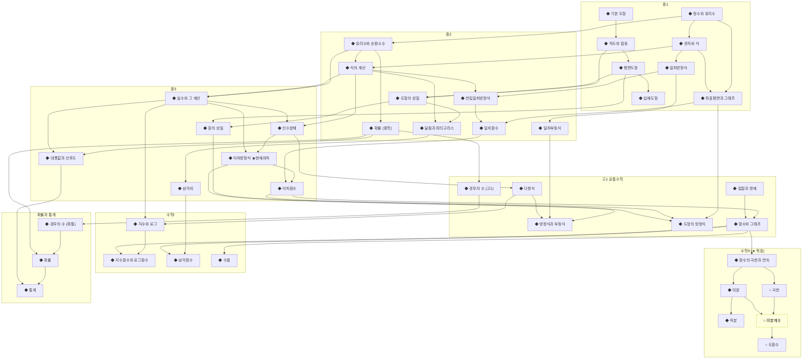

# 🕸️ Concept Dependency Graph (Phase 1 Skeleton)

이 파일은 모든 concept spoke의 `prerequisites:` / `enables:` frontmatter를 **JIT 스크립트가 파싱해 regenerate**한다. 직접 수정하지 말 것.

> **Phase 1 결과**: 중1~확률통계 단원 39 + 기존 미적분 정의 3 = **42 노드**, 62 엣지, 순환 0. 모든 노드 `mastery: unknown` (미분계수만 learning).
>
> **Color legend (mastery)**: 🟥 unknown · 🟧 learning · 🟩 proficient · 🟦 mastered.
> **Type**: ◆ unit · ○ definition · ◇ theorem · △ lemma · □ example.

---

## DAG (학년별 subgraph)

---

## Integrity Status

| Check | Result | Last Verified |
| :--- | :--- | :--- |
| Acyclic (no cycles) | ✅ ok (42 nodes, 62 edges) | 2026-05-16 |
| Bidirectional matching (`A.prereq ↔ B.enables`) | ✅ ok | 2026-05-16 |
| Orphan concepts | 0 | 2026-05-16 |
| 100%-Lineage (sources frontmatter) | ✅ all 42 nodes | 2026-05-16 |

---

## Topological Order (학습 권장 순서, 위상정렬 산출)

1. **중1 기초**: 정수와 유리수 → 문자와 식 → 일차방정식 → 좌표평면과 그래프 / 기본 도형 → 작도와 합동 → 평면도형 → 입체도형
2. **중2 확장**: 유리수와 순환소수 → 식의 계산 → 일차부등식 / 연립방정식 → 일차함수 / 도형의 성질 → 닮음과 피타고라스 / 확률(중학)
3. **중3 본격**: 실수 → 인수분해 → **이차방정식 ← 현재 위치** → 이차함수 / 삼각비 / 원의 성질 / 대푯값과 산포도
4. **고1 공통**: 다항식 → 방정식과 부등식 / 도형의 방정식 / 집합과 명제 → 함수와 그래프 / 경우의 수
5. **수학Ⅰ**: 지수와 로그 → 지수·로그 함수 / 삼각함수 / 수열
6. **수학Ⅱ**: 함수의 극한과 연속 → 미분 → 적분 ← **목표**
7. **확률과 통계** (선택): 경우의 수 → 확률 → 통계

---

## 🔗 Navigation
- **Concepts Hub**: [hubs/concepts.md](hubs/concepts.md)
- **Index**: [index.md](index.md)
