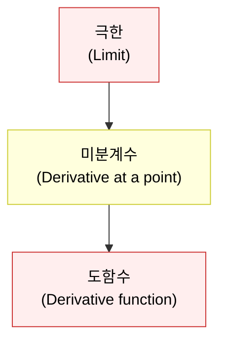

# 🕸️ Concept Dependency Graph

이 파일은 모든 concept spoke의 `prerequisites:` / `enables:` frontmatter를 **JIT 스크립트가 파싱해 regenerate**한다. 직접 수정하지 말 것. 노드 색은 mastery (D13)를 나타낸다.

> **Color legend**:
> - 🟥 `unknown` — 아직 학습 안 함
> - 🟧 `learning` — 학습 중
> - 🟩 `proficient` — 평가원 4점 2회 통과
> - 🟦 `mastered` — 킬러 1회 통과 + 90일 무강등

---

## DAG

---

## Integrity Status

| Check | Result | Last Verified |
| :--- | :--- | :--- |
| Acyclic (no cycles) | ✅ ok (3 nodes, 2 edges, DAG depth = 2) | 2026-05-16 |
| Bidirectional matching (`A.prereq ↔ B.enables`) | ✅ ok (all 2 edges matched) | 2026-05-16 |
| Orphan concepts (no prereq, no enables, no problem ref) | 0 | 2026-05-16 |

---

## Topological Order (학습 권장 순서)

1. [극한](concepts/극한.md) 🟥
2. [미분계수](concepts/미분계수.md) 🟧
3. [도함수](concepts/도함수.md) 🟥

---

## 🔗 Navigation
- **Concepts Hub**: [hubs/concepts.md](hubs/concepts.md)
- **Index**: [index.md](index.md)
