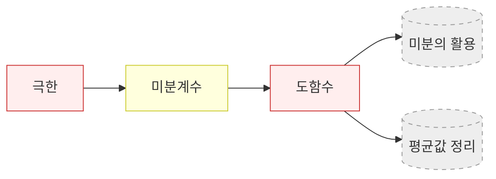

# 도함수 (Derivative function)

> **concept_type**: definition · **mastery**: 🟥 unknown
> **선수**: [미분계수](/concepts/미분계수) → [극한](/concepts/극한)
> **사용처**: (아직 없음 — 미분의 활용·평균값정리 등이 추가되면 enables 필드 갱신)

## 정의

함수 $y = f(x)$가 어떤 구간의 모든 점에서 미분 가능할 때, 각 점 $x$에 미분계수 $f'(x)$를 대응시키는 **새로운 함수**를 $f$의 **도함수**라 한다.

$$f'(x) \;=\; \lim_{h \to 0} \frac{f(x+h) - f(x)}{h}$$

기호: $f'(x)$, $\dfrac{dy}{dx}$, $\dfrac{d}{dx} f(x)$, $\dot f(x)$.

> **미분계수와의 차이**: [미분계수](/concepts/미분계수) $f'(a)$는 *한 점 $a$에서의 수*. 도함수 $f'(x)$는 *전 구간에 걸친 함수*. 결과적으로 $f'(a) = f'(x) \Big|_{x = a}$.

## 기본 도함수 공식 (수능 빈출)

| 원함수 $f(x)$ | 도함수 $f'(x)$ |
|:---|:---|
| $c$ (상수) | $0$ |
| $x^n$ ($n$ 실수) | $n x^{n-1}$ |
| $\sin x$ | $\cos x$ |
| $\cos x$ | $-\sin x$ |
| $e^x$ | $e^x$ |
| $\ln x$ ($x > 0$) | $\dfrac{1}{x}$ |

## 미분의 연산 법칙

- **상수배·합·차**: $(cf)' = cf'$, $(f \pm g)' = f' \pm g'$
- **곱**: $(fg)' = f'g + fg'$
- **몫**: $\left(\dfrac{f}{g}\right)' = \dfrac{f'g - fg'}{g^2}$ ($g \ne 0$)
- **합성함수(연쇄법칙)**: $\bigl[f(g(x))\bigr]' = f'(g(x)) \cdot g'(x)$

## 예제

$f(x) = x^3 - 2x + 5$의 도함수는?

$f'(x) = 3x^2 - 2$.

이는 *임의의* $x$에서 미분계수를 한 번에 알려주는 함수다. 예를 들어 $f'(0) = -2$, $f'(1) = 1$, $f'(2) = 10$.

## 개념 그래프 위치

## 다음 단계 (이 페이지에서 가지치는 미래 노드)

- 미분의 활용 (접선의 방정식, 함수의 증감/극값, 그래프 개형)
- 평균값 정리
- 적분 (부정적분으로의 역연산)
- 합성함수·매개변수·음함수 미분

## 본문

### 정확한 진술

함수 $f(x)$의 **도함수**(derivative)란, 정의역의 각 점 $x$에서 미분계수 $\lim_{h \to 0} \frac{f(x+h) - f(x)}{h}$를 함숫값으로 갖는 함수입니다. 도함수는 $f'(x)$ 또는 $\frac{df}{dx}$로 나타냅니다.

$$f'(x) = \lim_{h \to 0} \frac{f(x+h) - f(x)}{h}$$

이 극한이 존재하면 함수 $f$는 $x$에서 **미분가능**(differentiable)하다고 하며, $f'(x)$가 정의됩니다.

### 직관과 기하적 의미

미분계수는 한 점에서의 순간변화율인데, **도함수는 그것을 모든 점에 대해 동시에 나타낸 함수**입니다. 기하적으로는 곡선 $y = f(x)$ 위의 각 점 $(x, f(x))$에서 접선의 기울기를 함숫값으로 갖는 함수가 도함수입니다.

따라서 도함수를 통해 원래 함수의 증감을 파악할 수 있습니다. $f'(x) > 0$인 구간에서는 증가하고, $f'(x) < 0$인 구간에서는 감소하며, $f'(x) = 0$인 점은 극값의 후보가 됩니다. 이를 통해 함수의 개형을 완전히 결정할 수 있습니다.

### 간단한 예

$f(x) = x^2$의 도함수를 구하면:

$$f'(x) = \lim_{h \to 0} \frac{(x+h)^2 - x^2}{h} = \lim_{h \to 0} \frac{2xh + h^2}{h} = \lim_{h \to 0} (2x + h) = 2x$$

따라서 $f'(x) = 2x$입니다. 예를 들어 $x = 3$에서의 접선의 기울기는 $f'(3) = 6$입니다. (`sympy.diff(x**2, x)` → `2*x`)
