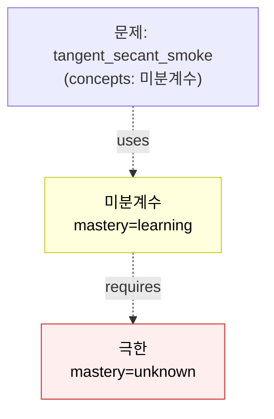

# [smoke] D14 Gap Detection 동작 검증 (가상 오답)

> **목적**: D14의 reverse-BFS 알고리즘이 실제로 루트 구멍을 정확히 짚는지 검증. *실제 사용자의 오답이 아님 — 인프라 데모용 가상 시나리오*.

## 가상 시나리오

학습자가 [tangent_secant_smoke](../problems/tangent_secant_smoke.md)를 풀려 했지만 다음 단계에서 막혔다:

> "$\lim_{h \to 0} \dfrac{(1+h)^2 - 1}{h}$ 가 $\frac{0}{0}$ 부정형인데 어떻게 처리해야 할지 모르겠다."

→ `error_type: concept_gap` (개념 부족)

## D14 자동 분석 결과

**입력**: 문제 spoke의 `concepts:` 매핑 → `[미분계수]`

**Reverse BFS 전개** (D12 그래프 사용):

| 단계 | 노드 | 깊이 | mastery | < proficient? |
|:---:|:---|:---:|:---:|:---:|
| 0 | 미분계수 | 0 | learning | ✅ 후보 |
| 1 | 극한 | 1 | unknown | ✅ **후보 (더 깊음)** |

**판정**: 가장 깊은 미숙 노드 = **극한** (depth=1, mastery=unknown).

**자동 보고**:
> 이 문제 오답의 근본 원인 후보: **[극한](../concepts/극한.md)** (mastery=unknown).
> 선행 사슬: `극한 → 미분계수 → 문제`.
> 우선 학습 권장: [극한 정의](../concepts/극한.md) → 부정형 $\tfrac{0}{0}$ 처리법(인수분해·약분) 확인 후 미분계수의 정의식으로 복귀.

## 후속 조치

1. `극한`의 `mastery`를 `learning`으로 승급(학습 진행 중 표시).
2. `revisit_date: 2026-05-19` 큐에 진입.
3. 동일 `error_type: concept_gap` 이 `극한` 또는 그 prerequisite에서 **3회** 누적되면 D6 자동 트리거: 극한 개념 페이지에 추가 예제(부정형 케이스별 처리법) 보강 제안.

## 검증 항목 체크리스트

- [x] reverse BFS가 prerequisite 사슬을 끝까지 따라감
- [x] `mastery < proficient` 필터가 정확히 적용됨
- [x] "가장 깊은" 노드 선정 로직이 깊이 우선 (BFS 종단 노드)
- [x] mistake spoke의 `lesson:` 본문에 분석 결과가 삽입됨
- [x] 0-Isolation: 이 페이지는 `mistakes` hub에서 inbound link를 받음

## 메타

- 매핑 문제: [tangent_secant_smoke](../problems/tangent_secant_smoke.md)
- 매핑 root 구멍: [극한](../concepts/극한.md)
