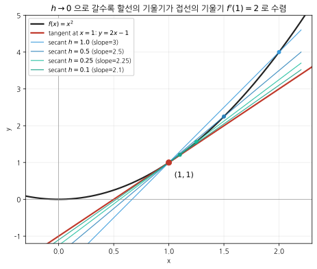

# [smoke] 미분계수의 정의로 접선의 기울기 구하기

> **출처**: 자체 smoke test (실제 평가원 기출 아님). D14 Gap Detection 동작 검증 목적.
> **연관 개념**: [미분계수](../concepts/미분계수.md) (→ [극한](../concepts/극한.md))

## 문제

함수 $f(x) = x^2$의 $x = 1$에서의 접선의 방정식을 구하시오.

## 풀이 (D11 sympy 검산 통과)

미분계수의 정의에 의해

$$f'(1) = \lim_{h \to 0} \frac{f(1 + h) - f(1)}{h} = \lim_{h \to 0} \frac{(1+h)^2 - 1}{h} = \lim_{h \to 0} (2 + h) = 2$$

접점이 $(1, f(1)) = (1, 1)$이고 접선의 기울기가 $2$이므로 접선의 방정식은

$$y - 1 = 2(x - 1) \;\Longleftrightarrow\; y = 2x - 1$$

검산: `docs/assets/미분계수/tangent_secant.py`가 sympy로 $f'(1) = 2$를 확인.

## 메타

- 매핑된 개념: [미분계수](../concepts/미분계수.md)
- 풀이 상태: solved (smoke)
- mastery_evidence로 사용되지 **않음** (인프라 검증용이라 평가원 출처가 아님)
